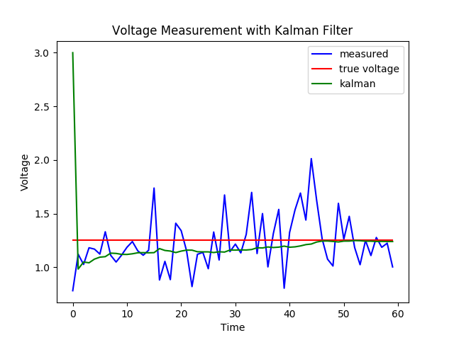
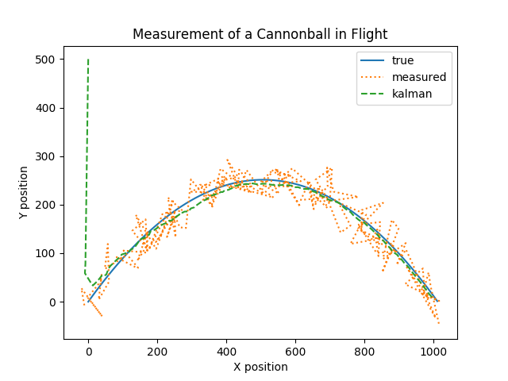

# kalman filter example

all credits to Greg Czerniak and his great [tutorial](http://greg.czerniak.info/guides/kalman1/)

---

## Single-Variable Example

- attempt to measure a constant DC voltage with a noisy voltmeter

## Multi-Variable Example

- cannonball's trajectory mid-flight

